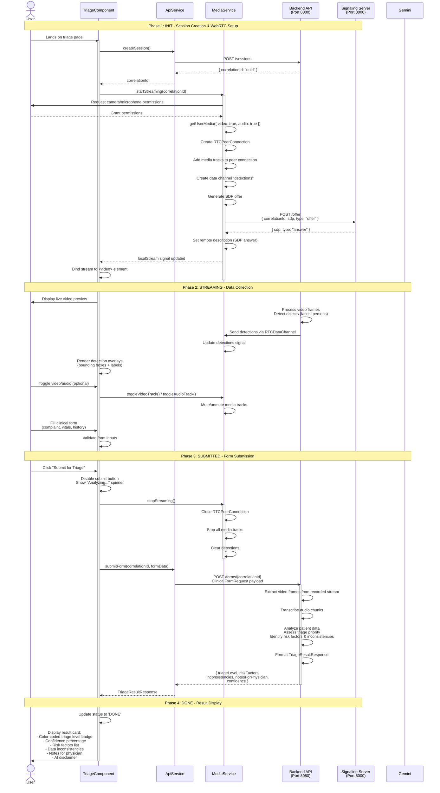

# Assisted Medical Triage - Angular Frontend

An AI-powered medical triage application built with Angular 20 that combines real-time WebRTC video/audio streaming with clinical form data to provide assisted triage assessments. This frontend application captures patient symptoms via camera/microphone, collects vital signs and medical history through a reactive form, and displays AI-generated triage recommendations.

## Features

- 🎥 **Real-time WebRTC Streaming**: Live video and audio capture with browser-based media device access
- 🤖 **AI Object Detection Overlay**: Real-time visual feedback with detection bounding boxes from backend ML models
- 📋 **Clinical Data Collection**: Structured reactive form for patient complaints, vital signs, and medical history
- 🏥 **Intelligent Triage Results**: Color-coded severity levels (LOW/MEDIUM/HIGH) with risk factors and confidence scores
- 🎨 **Material Design UI**: Clean, responsive interface built with Angular Material components
- 🔒 **Session-based Workflow**: Correlation ID tracking ensures data consistency across streaming and form submission

## Dataflow

The following sequence diagram illustrates the complete user journey from initialization through AI-assisted triage result display:



## Application Structure

The following diagram shows the high-level architecture and component relationships:

```mermaid
graph TB
    subgraph "Entry Point"
        Main[main.ts<br/>bootstrapApplication]
        Config[app.config.ts<br/>Global Providers]
        Routes[app.routes.ts<br/>Route Definitions]
    end
    
    subgraph "Components"
        App[App Component<br/>app.ts]
        Triage[TriageComponent<br/>triage.ts<br/>Main UI Controller]
        
        subgraph "Triage UI Elements"
            Video[Video Preview<br/>+ Detection Overlay]
            Controls[Media Controls<br/>Video/Audio Toggle]
            Form[Reactive Form<br/>Complaint | Vitals | History]
            Result[Result Card<br/>Triage Level + Details]
        end
    end
    
    subgraph "Services Layer"
        ApiSvc[ApiService<br/>HTTP Client]
        MediaSvc[MediaService<br/>WebRTC + Media Devices]
    end
    
    subgraph "Data Models"
        ReqModels[Request DTOs<br/>ClinicalFormRequest<br/>WebRTCOfferRequest]
        ResModels[Response DTOs<br/>SessionCreatedResponse<br/>TriageResultResponse<br/>Detection]
    end
    
    subgraph "Configuration"
        EnvDev[environment.ts<br/>localhost URLs]
        EnvProd[environment.prod.ts<br/>Template placeholders]
    end
    
    subgraph "External Services"
        Backend[Backend API<br/>Port 8080<br/>Spring Boot]
        Signaling[Signaling Server<br/>Port 8000<br/>WebRTC SDP Exchange]
    end
    
    Main --> Config
    Main --> App
    Config --> Routes
    App --> Triage
    Triage --> Video
    Triage --> Controls
    Triage --> Form
    Triage --> Result
    
    Triage --> ApiSvc
    Triage --> MediaSvc
    
    ApiSvc --> ReqModels
    ApiSvc --> ResModels
    MediaSvc --> ReqModels
    MediaSvc --> ResModels
    
    ApiSvc --> EnvDev
    ApiSvc --> EnvProd
    MediaSvc --> EnvDev
    MediaSvc --> EnvProd
    
    ApiSvc --> Backend
    MediaSvc --> Signaling
    
    style Triage fill:#e1f5ff
    style ApiSvc fill:#fff4e6
    style MediaSvc fill:#fff4e6
    style Backend fill:#f3e5f5
```

## How to Run Locally

### Prerequisites

- **Node.js** 18+ and npm (Angular 20 requires Node 18.19 or higher)
- **Backend Services** (must be running):
  - Main API server on port 8080 (Spring Boot)
  - WebRTC signaling server on port 8000
- **Browser with WebRTC support** (Chrome, Firefox, Edge, Safari)
- **Camera and microphone access** (browser will prompt for permissions)

### Installation

Clone the repository and install dependencies:

```bash
npm install
```

### Development Commands

**Start Development Server**

```bash
npm start
```

This runs `ng serve` and starts the application at [http://localhost:4200](http://localhost:4200).

**Run Unit Tests**

```bash
npm test
```

Executes Karma test runner with Jasmine framework.

**Build for Production**

```bash
npm run build
```

Outputs optimized build to `dist/` directory.

### Environment Configuration

The application uses Angular environment files for configuration:

- **Development**: [src/environments/environment.ts](src/environments/environment.ts)
  ```typescript
  export const environment = {
    production: false,
    apiUrl: 'http://localhost:8080',
    signalingUrl: 'http://localhost:8000'
  };
  ```

- **Production**: [src/environments/environment.prod.ts](src/environments/environment.prod.ts)
  - Uses template placeholders `${API_URL}` and `${SIGNALING_URL}`
  - Replaced at Docker build time via `sed` commands (see [Dockerfile](Dockerfile))

### Docker Setup (Optional)

For containerized local testing:

**Build Docker Image**

```bash
docker build \
  --build-arg API_URL=http://localhost:8080 \
  --build-arg SIGNALING_URL=http://localhost:8000 \
  -t triage-frontend .
```

**Run with Docker Compose**

```bash
docker-compose up
```

Refer to [README.Docker.md](README.Docker.md) and [compose.yaml](compose.yaml) for detailed Docker instructions.

## External API Dependencies

### Architecture Overview

**Important**: All AI processing occurs on the backend. The frontend is a thin client that orchestrates user interactions and displays pre-processed results.

### Backend API Endpoints

The frontend communicates with two backend services:

#### Main API Server (Port 8080)

| Method | Endpoint | Purpose | Request Body | Response |
|--------|----------|---------|--------------|----------|
| **POST** | `/sessions` | Create new triage session | `{}` (empty) | `{ correlationId: string }` |
| **POST** | `/forms/{correlationId}` | Submit clinical data for triage | `ClinicalFormRequest` | `TriageResultResponse` |

**ClinicalFormRequest Structure:**
```typescript
{
  complaint: {
    description: string,    // Required
    duration: string,       // Required
    severity: "mild" | "moderate" | "severe"
  },
  vitalSigns: {
    heartRate?: number,
    systolicBp?: number,
    diastolicBp?: number,
    temperature?: number,
    oxygenSaturation?: number
  },
  medicalHistory: {
    conditions?: string[],
    medications?: string[],
    allergies?: string[]
  }
}
```

**TriageResultResponse Structure:**
```typescript
{
  triageLevel: "LOW" | "MEDIUM" | "HIGH",
  riskFactors: string[],
  inconsistencies: string[],
  notesForPhysician: string,
  confidence: number  // 0.0 to 1.0
}
```

#### Signaling Server (Port 8000)

| Method | Endpoint | Purpose | Request Body | Response |
|--------|----------|---------|--------------|----------|
| **POST** | `/offer` | WebRTC SDP exchange | `{ correlationId, sdp, type }` | `{ sdp, type }` |

### Backend Processing

The backend Spring Boot service performs multimodal analysis:

**Data Processing:**
1. **Video Frames**: Extracted from WebRTC stream for visual analysis
2. **Audio Transcription**: Speech-to-text conversion of patient voice
3. **Clinical Form Data**: Structured patient complaint, vital signs, and medical history

**Analysis Tasks:**
- Assess triage priority level based on visual cues, audio tone, and clinical data
- Identify risk factors (e.g., abnormal vitals, concerning symptoms)
- Detect inconsistencies between visual appearance, reported symptoms, and vital signs
- Generate physician notes with actionable recommendations
- Provide confidence score for the assessment

### Frontend Configuration

Update [src/environments/environment.ts](src/environments/environment.ts) to point to your backend services:

```typescript
export const environment = {
  production: false,
  apiUrl: 'http://your-backend-host:8080',
  signalingUrl: 'http://your-signaling-host:8000'
};
```

For production deployments, environment variables are injected at Docker build time.

## Technology Stack

### Frontend
- **Framework**: Angular 20.3.0 (standalone components API)
- **UI Library**: Angular Material 20.2.14
- **State Management**: Angular Signals + RxJS 7.8
- **Forms**: Reactive Forms with built-in validators
- **TypeScript**: 5.6.3
- **WebRTC**: Browser native APIs (`RTCPeerConnection`, `getUserMedia`, `RTCDataChannel`)

### Backend (Separate Repository)
- **API Framework**: Spring Boot
- **Ports**: 8080 (main API), 8000 (signaling server)

### Deployment
- **Containerization**: Docker with multi-stage builds
- **Web Server**: Nginx (serves static Angular build)

## Project Structure

```
tech-fase-4-front/
├── src/
│   ├── app/
│   │   ├── triage/               # Main triage component
│   │   │   ├── triage.ts         # Component logic & state management
│   │   │   ├── triage.html       # Template with video, form, and results
│   │   │   └── triage.css        # Component styles
│   │   ├── services/
│   │   │   ├── api.service.ts    # HTTP client for backend API
│   │   │   └── media.service.ts  # WebRTC & media device management
│   │   ├── models/
│   │   │   └── api.models.ts     # TypeScript interfaces for DTOs
│   │   ├── app.ts                # Root component
│   │   ├── app.routes.ts         # Route configuration
│   │   └── app.config.ts         # Global providers
│   ├── environments/             # Environment-specific configuration
│   ├── index.html                # HTML entry point
│   ├── main.ts                   # Application bootstrap
│   └── styles.css                # Global styles
├── docs/                         # Additional documentation
├── public/                       # Static assets
├── angular.json                  # Angular CLI configuration
├── package.json                  # npm dependencies & scripts
├── Dockerfile                    # Multi-stage Docker build
├── compose.yaml                  # Docker Compose setup
├── DEPLOYMENT.md                 # Detailed deployment guide
└── README.md                     # This file
```

### Key Files

- **Main Component**: [src/app/triage/triage.ts](src/app/triage/triage.ts) - Core UI logic and state orchestration
- **API Service**: [src/app/services/api.service.ts](src/app/services/api.service.ts) - Backend communication
- **Media Service**: [src/app/services/media.service.ts](src/app/services/media.service.ts) - WebRTC streaming
- **Data Models**: [src/app/models/api.models.ts](src/app/models/api.models.ts) - Request/response interfaces

## Development Notes

### State Management Pattern

This application uses Angular 20's signal-based reactivity:

```typescript
// Component-level signals (TriageComponent)
correlationId = signal<string>('');
status = signal<UiStatus>('INIT');
triageResult = signal<TriageResultResponse | undefined>(undefined);

// Service-level signals (MediaService)
localStream = signal<MediaStream | undefined>(undefined);
detections = signal<Detection[]>([]);
```

### WebRTC Implementation

- **Signaling**: HTTP-based (POST /offer) instead of WebSocket for MVP simplicity
- **ICE Servers**: Empty array (localhost-only, no STUN/TURN for local dev)
- **Data Channel**: Named "detections" for receiving real-time object detection results
- **Media Constraints**: `{ video: true, audio: true }` with no specific device selection

### Form Validation

Reactive form with nested structure:
- **Required fields**: complaint description, duration, severity
- **Optional fields**: All vital signs and medical history
- **Custom parsing**: Comma-separated strings converted to arrays for backend

---

**Disclaimer**: This application provides AI-assisted triage suggestions for educational and demonstration purposes. It is not a substitute for professional medical diagnosis or treatment. Always consult qualified healthcare providers for medical decisions.
